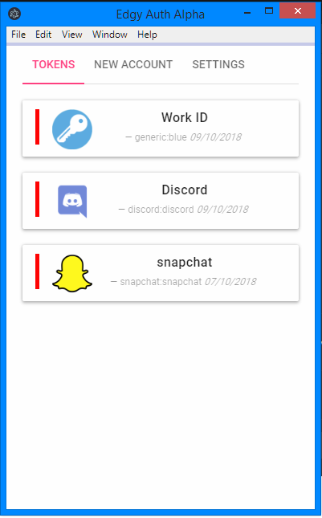
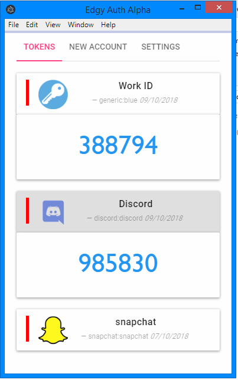
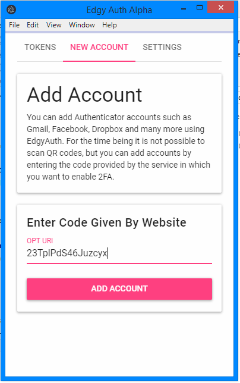

   
  

    
  

   
  

    
  

  

  EdgyAuth The All In One Open Source Material Design Cross Platform Two Step Authenticator! 
  

|                |    Images       |    |
|:---------------------:|:---------------:|:-------:|
|  |  |  |

## To do

| Feature               | Notes          | Added   |
|:---------------------:|:---------------:|:-------:|
| Generate 2FA codes    |Base32 genrate TOTP tokens.| ✅       |
| Add Account           || ✅       |
| Edit Account          |Edit account from local DB| ❌       |
| Remove Account        |Remove account from local DB| ✅       |
| Error Handling        |Handles errors with out crashing.| ✅       |
| Copy snackbar         || ✅       |
| Electron              |Runs as an desktop app using electron.| ✅       |
| Copy snackbar         |Notification when you copy your token.| ✅       |
| Local Storage         || ✅       |
| 30 Second timmer      || ✅       |
| Encrypted Backups      || ❌       |
| Encrypted Local Storage      || ❌       |
| REST API      |API to handle backups.| ❌       |

# Used Repositories

|  |  Licence/copyright |
|:----|:----------|
|JQuery v3.3.1| (c) JS Foundation and other contributors jquery.org/license|
|Material Bootstrap| (c) 2015 Daemon Internet Consultants MIT License (MIT)|
|Bootstrap 4| (c) 2011-2018 Twitter, Inc, (c) 2011-2018 The Bootstrap Authors (MIT)|
| Otpauth v3.2.1| (c) Héctor Molinero Fernández MIT License (MIT)|
| Popper.js |(C) Federico Zivolo 2018 MIT License (MIT)|
| Snackbar js |(c) 2016 Chris Brame MIT License (MIT)|